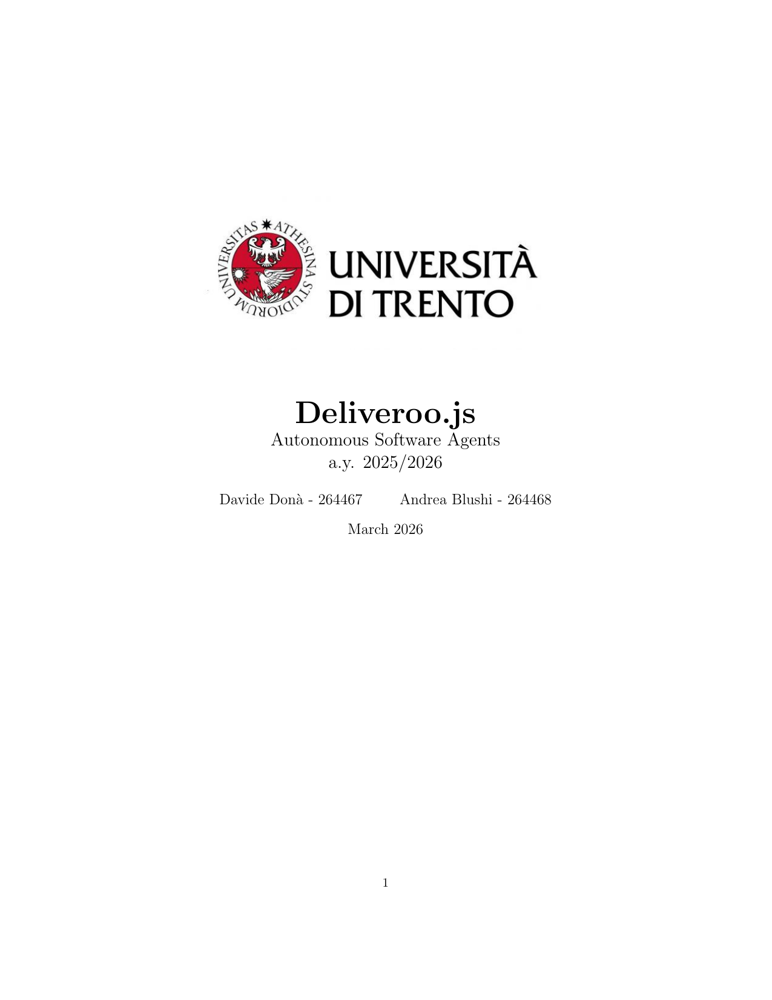
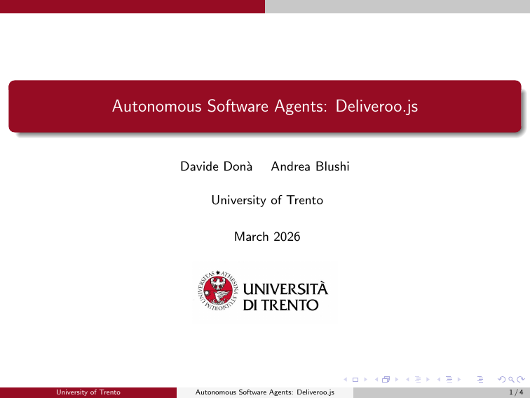

# Autonomous Software Agents Project

A project focused on the development and analysis of autonomous software agents, exploring their design, implementation, and applications in the Deliveroo.js domain, for the University of Trento.

<table align="center">
  <tr>
    <td align="center">
      <strong>
        <a href="docs/report.pdf">View Full Report (PDF)</a>
      </strong><br><br>
      <a href="docs/report.pdf">
        
      </a>
    </td>
    <td align="center">
      <strong>
        <a href="docs/presentation.pdf">View Full Presentation (PDF)</a>
      </strong><br><br>
      <a href="docs/presentation.pdf">
        
      </a>
    </td>
  </tr>
</table>

**Course:** Autonomous Software Agents  
**Professors:** Prof. Paolo Giorgini, Prof. Marco Robol  
**Authors:** Davide Donà, Andrea Blushi

---

## Overview

---

## Repository Structure

```
autonomous-software-agents/
├── README.md                         # Project overview (this file)
├── src/
│   └── index.js                      # Main JavaScript file for the project
├── docs/
│   ├── media/                        # Images, logos, and media assets
│   └── report/                       # Report-specific LaTeX files
│       ├── main.tex
│       ├── sections/
├── report.
```